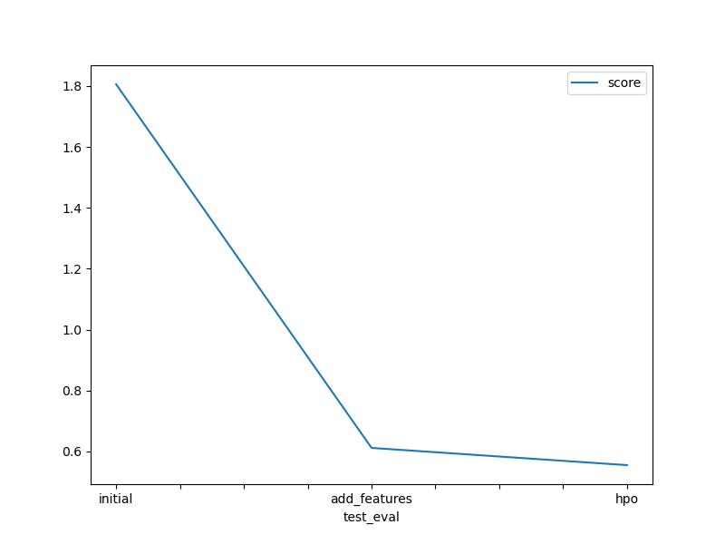

# Report: Predict Bike Sharing Demand with AutoGluon Solution
#### Anna Bajszczak

## Initial Training
### What did you realize when you tried to submit your predictions? What changes were needed to the output of the predictor to submit your results?
I didn’t realize anything, but I learned from the provided note that Kaggle would reject submissions with negative prediction values, so I followed that guidance. I checked my predictions and confirmed that all values were positive; however, to be on the safe side, I also clipped any values below 0 to exactly 0. 

### What was the top ranked model that performed?
TODO: The top ranked model WeightedEnsemble_L3, with a validation RMSE of -53.177545 and a Kaggle score of 1.80587.

## Exploratory data analysis and feature creation
### What did the exploratory analysis find and how did you add additional features?
During the exploratory data analysis (EDA), I performed an initial assessment of the dataset I downloaded from Kaggle. For example, the training set had more columns than the testing set, so I dropped the registration and casual columns. The dataset contained 10,886 rows and no missing values. The initial data types included integers, floats, and datetime objects. Some columns, such as weather and season, were integer representations of categorical variables. I converted these columns to the category data type. Additionally, I created new features from the datetime column by extracting the hour, day, month, and year into separate fields. The view of all features distribution gave bettwe ubderstanding about each column. For example, most of the records were non-holidays (0) and occurred during working days (1), spread across 2011 and 2012. In terms of temperature, it appears that the most common rental activity occurred between 15 to 30 degrees; temperatures below this range suggest it was too cold, and above it, too hot to rent. 

### How much better did your model preform after adding additional features and why do you think that is?
After adding features, the top-ranked model remained the same — WeightedEnsemble_L3 — but its performance improved significantly, achieving a validation RMSE of -30.354557 and a Kaggle score of 0.61122. I believe that by adding new features, the model was able to make better predictions, likely because the new features were informative and carried important signals for the target value.

## Hyper parameter tuning
### How much better did your model preform after trying different hyper parameters?
The top-ranked model changed to WeightedEnsemble_L2. The Kaggle score improved to 0.55468, but the validation RMSE increased to -34.443264, indicating slightly worse performance on the validation set.

### If you were given more time with this dataset, where do you think you would spend more time?
If I was given more time, I would spend it on identifying important features by diving into creating more features. Alternatively, I would probably try to fine-tune the model by adding additional hyperparameters. Since WeightedEnsemble_L3 performed the best both initially and after adding features, maybe better tuning could give an even better outcome.

### Create a table with the models you ran, the hyperparameters modified, and the kaggle score.
| Model         | n_estimators | max_depth | num_trials | Kaggle Score |
|---------------|--------------|-----------|------------|---------------|
| Initial       | default      | default   | default    | 1.80587       |
| Add Features  | default      | default   | default    | 0.61122       |
| HPO           | 200          | 20        | 10         | 0.55468       |

### Create a line plot showing the top model score for the three (or more) training runs during the project.

### Create a line plot showing the top kaggle score for the three (or more) prediction submissions during the project.

## Summary
Using AutoGluon, I followed the step-by-step approach provided in the template. I started by training a basic model, then added new features, and finally tried hyperparameter tuning. The initial Kaggle score was 1.80587, and after adding datetime-based features, it improved to 0.61122. After tuning hyperparameters, the score dropped further to 0.55468. These results show that adding useful features and tuning the model can really help improve performance. If I had more time, I’d keep working on feature engineering and experimenting with different model settings.
